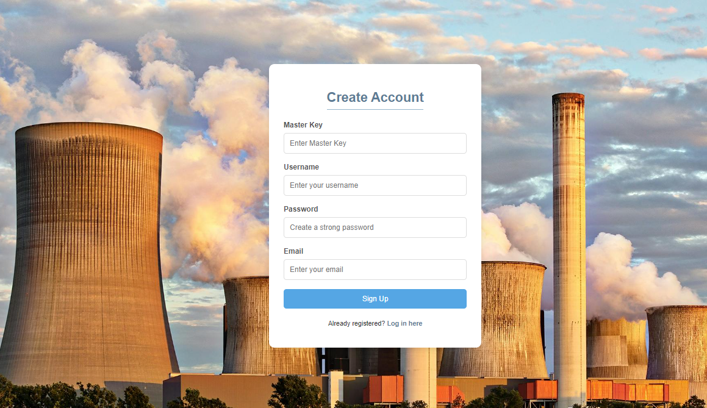
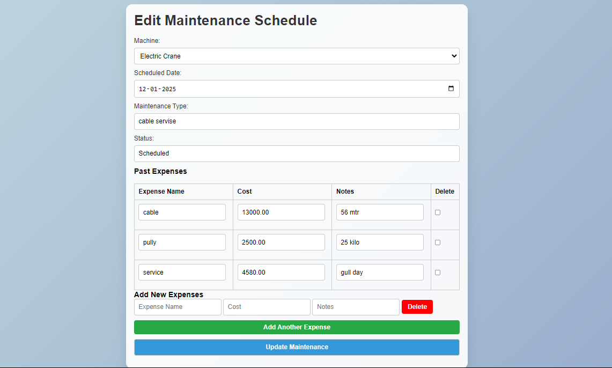
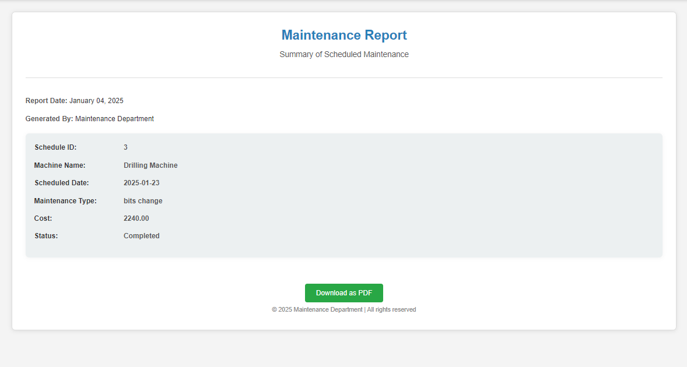

# Industrial Machine Maintenance Tracker

## 📌 Project Overview

This project is a **Flask-based Industrial Machine Maintenance Tracker** that helps manage machines, employees, work orders, and maintenance schedules efficiently. It includes features such as adding and editing machines, tracking maintenance schedules, and managing work orders.

## 🚀 Features

- **User Authentication**: Secure login and signup for administrators.
- **Machine Management**: Add, edit, and view machine details.
- **Employee Management**: Track employees and their assigned maintenance tasks.
- **Maintenance Scheduling**:
  - Assign employees to maintenance tasks.
  - Machines under maintenance are marked as "Not Available."
  - Completed maintenance updates the machine's status and parts used.
- **Work Orders**: Manage and update work orders efficiently.
- **Reporting**: View detailed maintenance history and reports.

## 📂 Folder Structure

```
INDUSTRIAL_MAINTENANCE_TRACKER/
│── static/
│   ├── result/(result images)
│   ├── images/ (for assets)
│
│── templates/
│   ├── add_employee.html
│   ├── add_machine.html
│   ├── add_maintenance.html
│   ├── add_workorder.html
│   ├── edit_employee.html
│   ├── edit_machine.html
│   ├── edit_maintenance.html
│   ├── edit_workorder.html
│   ├── employees.html
│   ├── home.html
│   ├── login.html
│   ├── machines.html
│   ├── maintenance.html
│   ├── report.html
│   ├── signup.html
│   ├── workorders.html
│
│── app.py
│── config.py
│── machine_tracker.db (SQLite database)
│── machine_tracker.sql (SQL Schema)
│── readme.md
│── requirements.txt
```

## 🔧 Installation & Setup

### 1️⃣ Prerequisites

- Python 3.x
- Flask
- MySQL (XAMPP recommended for local setup)

### 2️⃣ Clone the Repository

```sh
git clone https://github.com/Prashanth-000/Industrial-Machines-Management-and-Tracking-System.git

cd industrial-maintenance-tracker
```

### 3️⃣ Install Dependencies

```sh
pip install -r requirements.txt
```

### 4️⃣ Configure the Database

- Import `dbms_database.sql` into MySQL.
- Update `app..py` with your database credentials.
- Add credentials in MySQL Database connection settings line 11

### 5️⃣ Run the Application

```sh
python app.py
```

- Open `http://127.0.0.1:5000/` in your browser.
- Master Password for SignUp `9880`

## 📷 Screenshots

Below are the screenshots of the application, stored in the `static/result/` folder:

### 🔹 Login Page


### 🔹 Maintenance Management


### 🔹 Work Orders


### 🔹 Reports Page



## 📜 License

This project is open-source and available under the **MIT License**.

---

✨ **Developed with Python Flask & MySQL** ✨
✨ **BY PFB-000** ✨